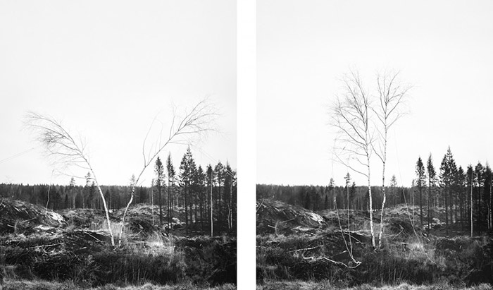
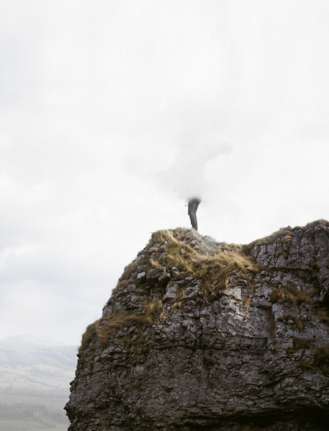
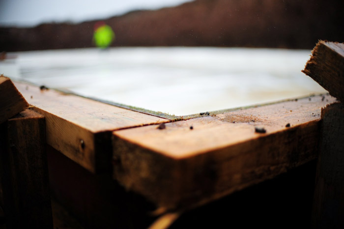
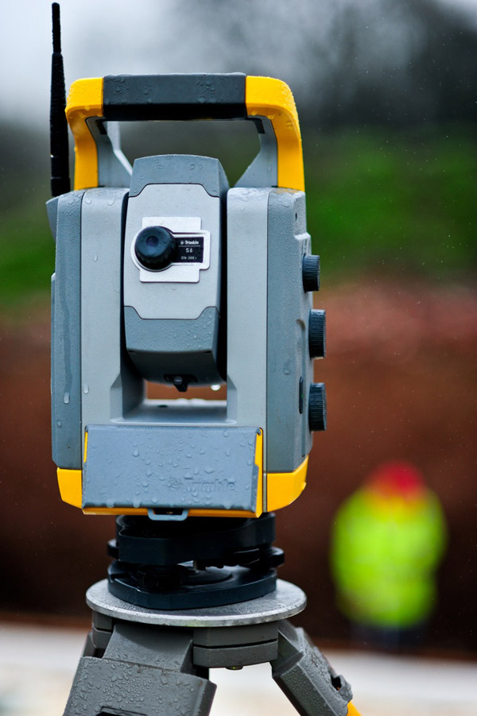
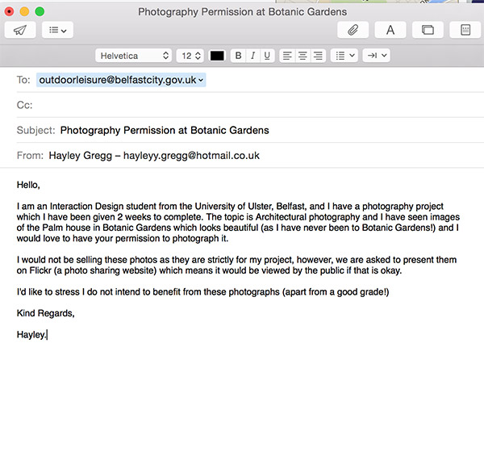
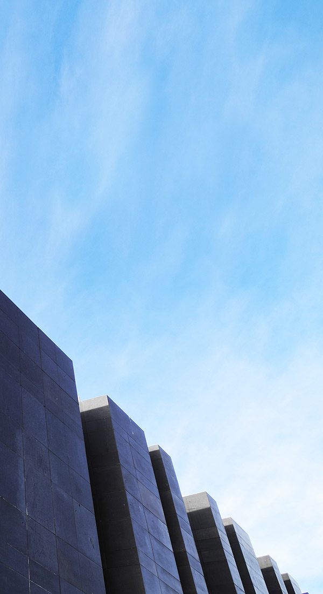
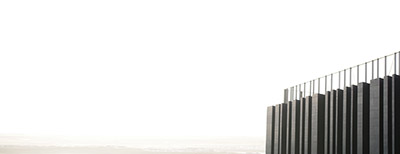

Project 01
==========

Photography
-----------

###Research

Our first project was to photograph architechture of our choice using the methods of 'Macro' & 'Micro'. Before I began to think of what architecture I could photograph, I researched about photographing architecture to give me ideas and tips:

* http://www.fotoblur.com/blog/1/architecture-photography-tips

* http://digital-photography-school.com/photographing-architecture/

* http://www.digitalcameraworld.com/2012/04/24/16-tips-for-abstract-architecture-photography/

One of the articles that interested me was the heading ['It's not just about buildings'](http://www.photographymad.com/pages/view/guide-to-architectural-photography) which states that when we think of arcitechture we automatically think of buildings, but other 'man-made structures' are considered architecture such as 'bridges, towers, windmills, monuments' etc. When I read this I got the idea of the sculpture at Broadway in Belfast called '[Rise](http://en.wikipedia.org/wiki/Rise_(sculpture))'. I love this sculpture as it is so eyecatching, especially at night when it lights up, and it also has a lot of detail.

With this idea in mind, I also started to research [photographing at night](http://www.digitalcameraworld.com/2012/02/17/night-photography-tips-9-essential-steps-for-beginners/), as some of the websites I found that provided tips suggested photographing architecture at night as sometimes they become more alive.

(Other articles about Night Photography):

* http://www.exposureguide.com/night-sky-photography-tips.htm

* http://www.digitalcameraworld.com/2014/02/07/77-photography-techniques-tips-and-tricks-for-taking-pictures-of-anything/5/

###Learning Photography

For Christmas I was amazed to recieve a Pentax S-K1 from my parents! 

I'm not big into photography myself, but the work of others does interest me. Therefore I thought this project would be the perfect chance for me to use it! Only thing is, I'm a complete novice to photography, therefore I had to try and learn about Aperature, Exposure, Shutter Speeds and ISO, which I find confusing!

A technique that really interests me is [long exposure] (http://www.bwvision.com/ultimate-guide-long-exposure-photography/) as it captures movement that can make for a really nice photo. I first discovered this technique last year when I attempted [Light Painting](https://www.flickr.com/photos/hayleygregg/sets/72157640644359754/):

However, I did not fully understand what was going on as my brother (who is into photography) helped me, so I was interested to find out how to do it and also understand the theory of what is happening. I found a really [helpful article](http://imaging.nikon.com/lineup/dslr/basics/04/02.htm
) which used animations to show the relationship of Shutter Speed and Aperature and this helped me to understand what happens inside the camera during the task of capturing a photo.

Struggling to work with and find all the tools on my camera, I had to Google [how to adjust the Aperature and Shutter Speed](http://photo.net/pentax-camera-forum/00NXn9) after having no success with the manual! (embarrassing) I found a nice article which was about [photographing cityscapes at night](https://iso.500px.com/cityscape-night-photography-tips/), even though I'm not photographing a cityscape, it still gives some handy tips and also mentions 'light trails' which involves long exposure.

An article about ISO on [Digital Trends](http://www.digitaltrends.com/photography/what-is-iso-camera-settings-explained/) helped me understand that the lower the ISO the better quality of the image. I also took composition into consideration, but the term 'composition' doesn't spring anything to my mind, so I decided to research it and I found an article of helpful tips '[7 Rules of Composition](https://urbantimes.co/2011/10/the-art-of-photography-accidental-composition/)' which helped jog my memory in preparation for taking photos. Looking back at the breif I decided to read about [viewpoints](https://urbantimes.co/2012/04/viewpoints-and-camera-angles/) which helped me to trash the idea of just taking a normal/common photo and do something different using angles. 

When looking at different photography techniques I came across [Zoom Bursts](http://www.digitalcameraworld.com/2012/07/11/4-ways-to-make-more-creative-zoom-burst-photos/) which can make a really interesting photo and how using long shutter speeds you can actually [capture the earth rotating](http://www.exposureguide.com/night-sky-photography-tips.htm)!

###Inspiration

Someone who is the perfect example of good composition using different viewpoints and inspired me was Richard Weston, some examples include the [Ulster Museum](https://www.flickr.com/photos/acejet170/sets/72157623516856557) and [Ferry](https://www.flickr.com/photos/acejet170/sets/72157630663211464/). I actually like a lot of his photos, I like the image below because by the tree being upside down it makes for a more interesting image, which is what Weston is all about.

####Unsplash Inpiration

#####Thomas Holtkötter

I find Thomas's images inspiring as he uses a variety of viewpoints to make some striking and interesting images which I love:

The image below made me think of what I could do with the Rise sculpture:

#####Keith Misner

I find this image very interesting because of the focal point:

#####Matthew Wiebe

#####Mika Ruusunen

This image is similar to Thomas's and I actually think it might be the same building, it too reminded me of the Rise sculpture:

#####Axel Antas

I found Axel Antas on Unsplash and decided to have a look at his website. I found really cool pictures of trees, '[Shaped Views](http://www.axelantas.net/shaped-views/)', which were in pairs, displayed a bit like spot the difference. I realised from the caption that Antas had 'temporarily altered the shape of a tree top by tying ropes to various branches and pulling them to one side' and although we have the ability (in this age) to do this digitally, the emphasis was the physical process involved, which I found very inspiring.

Another of Antas work was [Obstructed Views](http://www.axelantas.net/obstructed-views/) which I thought was pretty cool because of this figure that is placed in a number of scenarios

####Magnum Photos

I took a look at Magnum Photos and I liked the photo below by Christopher Anderson and thought I should add it as it includes Architecture even though it is not the focal point in the shot:

<!-- http://www.magnumphotos.com/C.aspx?VP3=SearchDetail&VBID=&PN=1&IID=2K7O3R9710H2 --> 

####Local Photographers

I researched some photographers in Belfast, specifically trying to find those that photographed architecture. Below are some of the photographers I found and images I like from them:

* [Brian Morrison](http://www.brianmorrison.co.uk/portfolio/architecture-landscapes/index.html)

* [Neil Harrison](http://neilharrisonphotography.com/wp/farrans-construction/
)

 (This image inspired me to look into long exposure photography)

* [Shutterblink](http://www.shutterblink.co.uk)

This is my brothers website. I look up to him for inspiration as over the years he has become very passionate about photography, I always ask him for tips and actually borrowed his tripod for this project! He is very passionate about taking photographs that do not involve extreme editing on Photoshop, he believes the efoort should be put into the settings used to get the best quality photograph. So for this project, I decided to see if he had any images specifically on architecture. 

The closest I could find was images on construction which inspired me to really think about what to capture in the frame:

###Choosing the location

The Rise was just one idea I had for the project, I had a whole list:

* Mossley Mill
* Ballyclare Leisure Center
* New Ulster University construction in Belfast (too common)
* A windmill
* Knockagh Monument
* The Palm House at Botanic Gardens
* The Causeway Center

I chose two from the list, and taking the advice given in class, I decided to enquire about photographing both of the buildings, just like I had for Rise. Below is a screenshot of the email I sent to both Belfast City and the Causeway Centre:

I was very pleased to hear from Susan Smith (Booking & Sales Co-ordinator) after two hours of sending the email! So that week I booked in and when I nervously arrived I was warmly greeted and happily left to do what I had to do!

The reason I chose the Causeway Centre is because I thought it would be something no one else would think of as it is relativly new, and I wanted to be different. I also came across an [article](http://www.dezeen.com/2012/10/18/giants-causeway-visitors-centre-by-heneghan-peng-architects/) which had really nice photos of the Centre.

The day before the shoot it hit me that I had only researched and been advised by my brother how to shoot at night! So I had to then begin and learn the reccommended settings and advice for shooting during the day! (I also looked into foggy weather as I wasn't sure what the weather would be since it is so unpredictable!) 

Here are two websites that helped me:

* http://digital-photography-school.com/bright-ideas-for-shooting-in-midday-sun/ 

* http://digital-photography-school.com/moving-toward-manual-settings-understanding-basic-daylight-exposure-and-equivelant-exposure/

I also learned about the [Sunny 16 rule](http://en.wikipedia.org/wiki/Sunny_16_rule) that other websites had mentioned, which provides reccomendations for what the aperture should be set to in certain conditions.

Unfortunatly as I took so long taking photos of the building I didn't get a chance to take some of the Causeway or the building at night! (As of course the day of the shoot the sun didnt set until later than usual) However, I was confident I had enough photos to work with.

Overall I am very pleased with the results of my [Rise](https://www.flickr.com/photos/hayleygregg/sets/72157650336010408/) and [Causeway Visitor Centre](https://www.flickr.com/photos/hayleygregg/sets/72157648413214674/) photos! However, the hard part is choosing the 6 Macro and Micro!

###Decision Time

Finally I have made a decision on what photos to use for submission! For over a week I kept looking at both the Rise and Causeway Centre photos and I just couldn't make up my mind! I'm not that good at making decisions in any situation so I seeked someones advice. I asked Richard Weston for his advice, showing him the photos I had taken, as I follow him on Flickr and think he has really interesting photos that take a different perspective on things which I like. We both love the Rise photos but he advised me that I had more to work with using the Causeway photos, and he actually inspired me to revisit some of the photos I had already edited or hadn't used and see if I could crop into them even more, or change the orientation to portrait instead of landscape or vise versa. He also helped me with Photoshop as I don't really know much about retouching and tend to just play around with the brightness, contrast, vibrance and saturation levels.

I learned that I can transform images to be portrait by using the Stretch tool in Photoshop which allows you to drag a section of the image and stretch it out to fill the blank space. However, sometimes it doesnt work on some images, but he explained in the case of the sky you can sometimes get away with it without it looking like it's been stretched. This technique is how I came up with both of the images below, which are actually included in my submission:

Here is the link to my [Flickr Collection](https://www.flickr.com/photos/hayleygregg/collections/72157650571663437/) which also includes an ['Extra'](https://www.flickr.com/photos/hayleygregg/sets/72157650965275096/) set for some of the Rise photos I couldn't resist showing! ;-)

Book Covers
----------------

For the Book Covers, I had a couple of styles in mind, such as lettering, pattern and typography. I had the idea of lettering as this is an area I have been trying to develop my skills in, and there arn't a lot of book covers with hand-lettering out there. 

Pattern was inspired by Coralie Bickford-Smith and Marian Bantjes. I love Coralie Bickford-Smiths book cover designs, I think what makes her work more interesting is that she uses inspiration from the books themselves to make her cover designs meaningful.

An example of this is her 'Great Food' series cover which are [based on ceramic styles from each book’s time period](http://www.designsponge.com/2011/03/coralie-bickford-smith-great-food-covers.html):

I also love the spines of these books as they work as a collection, which can sometimes be used as a marketing strategy to tempt customers into wanting to purchase the whole series:

One of my favourite book cover designs of Coralie's is her Penguin Classics Series. I found [this article](http://www.designsponge.com/2009/10/interview-coralie-bickford-smith-penguin-classics.html) which inspired me as Coralie talks about how she decided to conform to a grid for consistancy and 'a recognizable style that could work across a series of ten or more books, while allowing the covers to convey something of the character of the individual titles.' 

This is another example of how she cleverly connects and relates the cover design with the book as she explained in [the article](http://www.designsponge.com/2009/10/interview-coralie-bickford-smith-penguin-classics.html):

>> The peacock feather on Dorian Grey, for example, plays on the book’s themes of vanity and the superficial, whereas the leaf motif on Jane Eyre refers directly to the lightning-blasted chestnut tree, a concrete element in the text that serves as a potent symbol of the book’s central relationship.

I love Marian Bantjes's work also. At Christmas I purchased some of her books, one being 'I Wonder' which is beautifully designed! The pattern and gold colour used is so eyecatching it just jumps out of the bookshelf!

 
 
Coralie has also used eyecatching metallic colours for one of her book cover designs for [F. Scott Fitzgerald, 2010](http://cb-smith.com/f-scott-fitzgerald/), which is also another favourite of mine:
 
 
 

Recently I discovered the beautiful design for [Pablo Neruda’s Love Poems](http://www.bantjes.com/project/love-poems) by Bantjes, which use copper foil on pink for the cover which really captures the beauty of the work:

Bantjes also uses the theme of pattern in her work, I found these book covers she designed which use elaborate borders to decorate the titles. These remind me of the Penguin composition rules that Jan Tschichold created for standardising Penguin book covers.

Bantjes also designed many magazine covers:

Most of her work involves elaborate designs, I really loved this image I found on Pinterest which was actually by Jessica Hische dedicated to Bantjes!

Recently Hische designed book covers for the 'Penguin Drop Cap' Series, inspired by what made her sucessful, her '[Daily Drop Cap](http://www.dailydropcap.com)' Project!

Like Coraline, Hische based each design on the narrative of the story. In a [video](https://www.youtube.com/watch?v=xVoAO-DE7zo) I found on Youtube she talked about the covers and explained that she wanted to capture the idea of the book with the drop cap but in a subtile way rather than being highly illustrated. The video also includes Paul Buckley (the Art Director) who explained that the Drop Cap Series is 26 books from A to Z, so when choosing the colour it was decided it should start at red for A and go down the colour spectrum creating a rainbow of colours when displayed together (similar to Coraline's 'Great Food' series).

This was what inspired one of my ideas for the book covers.  I had been thinking about what genre I would choose for the project, but I struggled with this because as a child I hated reading. It has only been the past couple of years that I have began to read more, and the main reason is to help with studying or learning! The last time I done this project, I chose the theme of Childrens Books, so I wanted to do something different. Although because I don't read a lot I didn't have a lot of choices, as I strongly believed I needed to have an idea of what the book was about in order to capture the story in the cover, the same way Coraline and Hische did. 

Struggling and running out of time, I decided to go with one of my ideas, Comic Books. I had a couple of superheros in mind, but when I researched Batman I realised he was not  part of the [Marvel superheros](http://marvel.com/characters) that my other two ideas (Spiderman and Wolverine) were part of. Therefore I had to choose another character, I thought Iron Man could be quite cool, but I have never seen the movie and thought it wouldn't be the right choice because I don't know a lot about him or the story. In the end I decided to go with Captain America as I remember a lot of my friends would mention him and he had a distinct style of costume which I thought would make the cover instantly recognisable, which is what I would like to achieve.

<!--Jan Tschichold Penguin Composition http://retinart.net/graphic-design/jan-tschicholds-inspiring-penguins/-->

