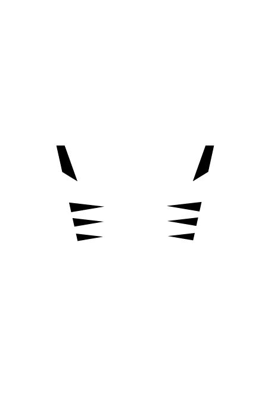
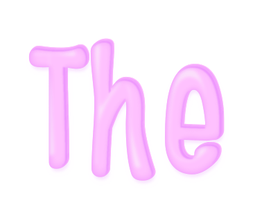
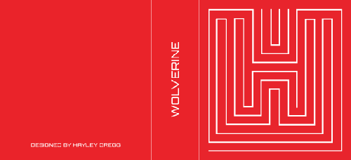

Project 01
==========

Photography
-----------

###Research

Our first project was to photograph architecture of our choice using the methods of 'Macro' & 'Micro'. Before I began to think of what architecture I could photograph, I researched about photographing architecture to give me ideas and tips:

* http://www.fotoblur.com/blog/1/architecture-photography-tips

* http://digital-photography-school.com/photographing-architecture/

* http://www.digitalcameraworld.com/2012/04/24/16-tips-for-abstract-architecture-photography/

One of the articles that interested me was the heading ['It's not just about buildings'](http://www.photographymad.com/pages/view/guide-to-architectural-photography) which states that when we think of architecture we automatically think of buildings, but other 'man-made structures' are considered architecture such as 'bridges, towers, windmills, monuments' etc. When I read this I got the idea of the sculpture at Broadway in Belfast called '[Rise](http://en.wikipedia.org/wiki/Rise_(sculpture))'. I love this sculpture as it is so eye-catching, especially at night when it lights up, and it also has a lot of detail.

With this idea in mind, I also started to research [photographing at night](http://www.digitalcameraworld.com/2012/02/17/night-photography-tips-9-essential-steps-for-beginners/), as some of the websites I found that provided tips suggested photographing architecture at night as sometimes they become more alive.

(Other articles about Night Photography):

* http://www.exposureguide.com/night-sky-photography-tips.htm

* http://www.digitalcameraworld.com/2014/02/07/77-photography-techniques-tips-and-tricks-for-taking-pictures-of-anything/5/

###Learning Photography

For Christmas I was amazed to receive a Pentax S-K1 from my parents! 

I'm not big into photography myself, but the work of others does interest me. Therefore I thought this project would be the perfect chance for me to use it! Only thing is, I'm a complete novice to photography, therefore I had to try and learn about Aperture, Exposure, Shutter Speeds and ISO, which I find confusing!

A technique that really interests me is [long exposure] (http://www.bwvision.com/ultimate-guide-long-exposure-photography/) as it captures movement that can make for a really nice photo. I first discovered this technique last year when I attempted [Light Painting](https://www.flickr.com/photos/hayleygregg/sets/72157640644359754/):

However, I did not fully understand what was going on as my brother (who is into photography) helped me, so I was interested to find out how to do it and also understand the theory of what is happening. I found a really [helpful article](http://imaging.nikon.com/lineup/dslr/basics/04/02.htm
) which used animations to show the relationship of Shutter Speed and Aperture and this helped me to understand what happens inside the camera during the task of capturing a photo.

Struggling to work with and find all the tools on my camera, I had to Google [how to adjust the Aperture and Shutter Speed](http://photo.net/pentax-camera-forum/00NXn9) after having no success with the manual! (embarrassing) I found a nice article which was about [photographing cityscapes at night](https://iso.500px.com/cityscape-night-photography-tips/), even though I'm not photographing a cityscape, it still gives some handy tips and also mentions 'light trails' which involves long exposure.

An article about ISO on [Digital Trends](http://www.digitaltrends.com/photography/what-is-iso-camera-settings-explained/) helped me understand that the lower the ISO the better quality of the image. I also took composition into consideration, but the term 'composition' doesn't spring anything to my mind, so I decided to research it and I found an article of helpful tips '[7 Rules of Composition](https://urbantimes.co/2011/10/the-art-of-photography-accidental-composition/)' which helped jog my memory in preparation for taking photos. Looking back at the brief I decided to read about [viewpoints](https://urbantimes.co/2012/04/viewpoints-and-camera-angles/) which helped me to trash the idea of just taking a normal/common photo and do something different using angles. 

When looking at different photography techniques I came across [Zoom Bursts](http://www.digitalcameraworld.com/2012/07/11/4-ways-to-make-more-creative-zoom-burst-photos/) which can make a really interesting photo and how using long shutter speeds you can actually [capture the earth rotating](http://www.exposureguide.com/night-sky-photography-tips.htm)!

###Inspiration

Someone who is the perfect example of good composition using different viewpoints and inspired me was Richard Weston, some examples include the [Ulster Museum](https://www.flickr.com/photos/acejet170/sets/72157623516856557) and [Ferry](https://www.flickr.com/photos/acejet170/sets/72157630663211464/). I actually like a lot of his photos, I like the image below because by the tree being upside down it makes for a more interesting image, which is what Weston is all about.

####Unsplash Inspiration

#####Thomas Holtkötter

I find Thomas's images inspiring as he uses a variety of viewpoints to make some striking and interesting images which I love:

The image below made me think of what I could do with the Rise sculpture:

#####Keith Misner

I find this image very interesting because of the focal point:

#####Matthew Wiebe

#####Mika Ruusunen

This image is similar to Thomas's and I actually think it might be the same building, it too reminded me of the Rise sculpture:

#####Axel Antas

I found Axel Antas on Unsplash and decided to have a look at his website. I found really cool pictures of trees, '[Shaped Views](http://www.axelantas.net/shaped-views/)', which were in pairs, displayed a bit like spot the difference. I realised from the caption that Antas had 'temporarily altered the shape of a tree top by tying ropes to various branches and pulling them to one side' and although we have the ability (in this age) to do this digitally, the emphasis was the physical process involved, which I found very inspiring.

Another of Antas work was [Obstructed Views](http://www.axelantas.net/obstructed-views/) which I thought was pretty cool because of this figure that is placed in a number of scenarios

####Magnum Photos

I took a look at Magnum Photos and I liked the photo below by Christopher Anderson and thought I should add it as it includes Architecture even though it is not the focal point in the shot:

<!-- http://www.magnumphotos.com/C.aspx?VP3=SearchDetail&VBID=&PN=1&IID=2K7O3R9710H2 --> 

####Local Photographers

I researched some photographers in Belfast, specifically trying to find those that photographed architecture. Below are some of the photographers I found and images I like from them:

* [Brian Morrison](http://www.brianmorrison.co.uk/portfolio/architecture-landscapes/index.html)

* [Neil Harrison](http://neilharrisonphotography.com/wp/farrans-construction/
)

 (This image inspired me to look into long exposure photography)

* [Shutterblink](http://www.shutterblink.co.uk)

This is my brothers website. I look up to him for inspiration as over the years he has become very passionate about photography, I always ask him for tips and actually borrowed his tripod for this project! He is very passionate about taking photographs that do not involve extreme editing on Photoshop, he believes the effort should be put into the settings used to get the best quality photograph. So for this project, I decided to see if he had any images specifically on architecture. 

The closest I could find was images on construction which inspired me to really think about what to capture in the frame:

###Choosing the location

The Rise was just one idea I had for the project, I had a whole list:

* Mossley Mill
* Ballyclare Leisure Center
* New Ulster University construction in Belfast (too common)
* A windmill
* Knockagh Monument
* The Palm House at Botanic Gardens
* The Causeway Center

I chose two from the list, and taking the advice given in class, I decided to enquire about photographing both of the buildings, just like I had for Rise. Below is a screenshot of the email I sent to both Belfast City and the Causeway Centre:

I was very pleased to hear from Susan Smith (Booking & Sales Coordinator) after two hours of sending the email! So that week I booked in and when I nervously arrived I was warmly greeted and happily left to do what I had to do!

The reason I chose the Causeway Centre is because I thought it would be something no one else would think of as it is relatively new, and I wanted to be different. I also came across an [article](http://www.dezeen.com/2012/10/18/giants-causeway-visitors-centre-by-heneghan-peng-architects/) which had really nice photos of the Centre.

The day before the shoot it hit me that I had only researched and been advised by my brother how to shoot at night! So I had to then begin and learn the recommended settings and advice for shooting during the day! (I also looked into foggy weather as I wasn't sure what the weather would be since it is so unpredictable!) 

Here are two websites that helped me:

* http://digital-photography-school.com/bright-ideas-for-shooting-in-midday-sun/ 

* http://digital-photography-school.com/moving-toward-manual-settings-understanding-basic-daylight-exposure-and-equivelant-exposure/

I also learned about the [Sunny 16 rule](http://en.wikipedia.org/wiki/Sunny_16_rule) that other websites had mentioned, which provides recommendations for what the aperture should be set to in certain conditions.

Unfortunately as I took so long taking photos of the building I didn't get a chance to take some of the Causeway or the building at night! (As of course the day of the shoot the sun didn't set until later than usual) However, I was confident I had enough photos to work with.

Overall I am very pleased with the results of my [Rise](https://www.flickr.com/photos/hayleygregg/sets/72157650336010408/) and [Causeway Visitor Centre](https://www.flickr.com/photos/hayleygregg/sets/72157648413214674/) photos! However, the hard part is choosing the 6 Macro and Micro!

###Decision Time

Finally I have made a decision on what photos to use for submission! For over a week I kept looking at both the Rise and Causeway Centre photos and I just couldn't make up my mind! I'm not that good at making decisions in any situation so I needed someone's advice. I asked Richard Weston for his advice, showing him the photos I had taken, as I follow him on Flickr and think he has really interesting photos that take a different perspective on things which I like. We both love the Rise photos but he advised me that I had more to work with using the Causeway photos, and he actually inspired me to revisit some of the photos I had already edited or hadn't used and see if I could crop into them even more, or change the orientation to portrait instead of landscape or vise versa. He also helped me with Photoshop as I don't really know much about retouching and tend to just play around with the brightness, contrast, vibrance and saturation levels.

I learned that I can transform images to be portrait by using the Stretch tool in Photoshop which allows you to drag a section of the image and stretch it out to fill the blank space. However, sometimes it doesn't work on some images, but he explained in the case of the sky you can sometimes get away with it without it looking like it's been stretched. This technique is how I came up with both of the images below, which are actually included in my submission:

Here is the link to my [Flickr Collection](https://www.flickr.com/photos/hayleygregg/collections/72157650571663437/) which also includes an ['Extra'](https://www.flickr.com/photos/hayleygregg/sets/72157650965275096/) set for some of the Rise photos I couldn't resist showing! ;-)

Book Covers
----------------

For the Book Covers, I had a couple of styles in mind, such as lettering, pattern and typography. I had the idea of lettering as this is an area I have been trying to develop my skills in, and there aren't a lot of book covers with hand-lettering out there. 

Pattern was inspired by Coralie Bickford-Smith and Marian Bantjes. I love Coralie Bickford-Smiths book cover designs, I think what makes her work more interesting is that she uses inspiration from the books themselves to make her cover designs meaningful.

An example of this is her 'Great Food' series cover which are [based on ceramic styles from each book’s time period](http://www.designsponge.com/2011/03/coralie-bickford-smith-great-food-covers.html):

I also love the spines of these books as they work as a collection, which can sometimes be used as a marketing strategy to tempt customers into wanting to purchase the whole series:

One of my favorite book cover designs of Coralie's is her Penguin Classics Series. I found [this article](http://www.designsponge.com/2009/10/interview-coralie-bickford-smith-penguin-classics.html) which inspired me as Coralie talks about how she decided to conform to a grid for consistency and 'a recognizable style that could work across a series of ten or more books, while allowing the covers to convey something of the character of the individual titles.' 

This is another example of how she cleverly connects and relates the cover design with the book as she explained in [the article](http://www.designsponge.com/2009/10/interview-coralie-bickford-smith-penguin-classics.html):

> The peacock feather on Dorian Grey, for example, plays on the book’s themes of vanity and the superficial, whereas the leaf motif on Jane Eyre refers directly to the lightning-blasted chestnut tree, a concrete element in the text that serves as a potent symbol of the book’s central relationship.

I love Marian Bantjes's work also. At Christmas I purchased some of her books, one being 'I Wonder' which is beautifully designed! The pattern and gold colour used is so eye-catching it just jumps out of the bookshelf!

 
 
Coralie has also used eye-catching metallic colours for one of her book cover designs for [F. Scott Fitzgerald, 2010](http://cb-smith.com/f-scott-fitzgerald/), which is also another favorite of mine:
 
 
 

Recently I discovered the beautiful design for [Pablo Neruda’s Love Poems](http://www.bantjes.com/project/love-poems) by Bantjes, which use copper foil on pink for the cover which really captures the beauty of the work:

Bantjes also uses the theme of pattern in her work, I found these book covers she designed which use elaborate borders to decorate the titles. These remind me of the Penguin composition rules that Jan Tschichold created for standardising Penguin book covers.

Bantjes also designed many magazine covers:

Most of her work involves elaborate designs, I really loved this image I found on Pinterest which was actually by Jessica Hische dedicated to Bantjes!

Recently Hische designed book covers for the 'Penguin Drop Cap' Series, inspired by what made her successful, her '[Daily Drop Cap](http://www.dailydropcap.com)' Project!

Like Coralie, Hische based each design on the narrative of the story. In a [video](https://www.youtube.com/watch?v=xVoAO-DE7zo) I found on Youtube she talked about the covers and explained that she wanted to capture the idea of the book with the drop cap but in a subtle way rather than being highly illustrated. The video also includes Paul Buckley (the Art Director) who explained that the Drop Cap Series is 26 books from A to Z, so when choosing the colour it was decided it should start at red for A and go down the colour spectrum creating a rainbow of colours when displayed together (similar to Coralie's 'Great Food' series).

This was what inspired one of my ideas for the book covers.  I had been thinking about what genre I would choose for the project, but I struggled with this because as a child I hated reading. It has only been the past couple of years that I have began to read more, and the main reason is to help with studying or learning! The last time I done this project, I chose the theme of Children's Books, so I wanted to do something different. Although because I don't read a lot I didn't have a lot of choices, as I strongly believed I needed to have an idea of what the book was about in order to capture the story in the cover, the same way Coralie and Hische did. 

Struggling and running out of time, I decided to go with one of my ideas, Comic Books. I had a couple of superheroes in mind, but when I researched Batman I realised he was not  part of the [Marvel superheroes](http://marvel.com/characters) that my other two ideas (Spiderman and Wolverine) were part of. Therefore I had to choose another character, I thought Iron Man could be quite cool, but I have never seen the movie and thought it wouldn't be the right choice because I don't know a lot about him or the story. ['Guardians of the Galaxy'](http://marvel.com/characters/70/guardians_of_the_galaxy) seemed to be talked about in our lectures and class, and my friend also did a WAP portrait of 'Groot' who I didn't even  know! So when I seen Groot I thought it would be quite cool to do him, but again I didn't really know him or the team he is part of so I felt it wasn't right. 

In the end I decided to go with Captain America as I remember a lot of my friends would mention him and he had a distinct style of costume which I thought would make the cover instantly recognisable, which is what I aimed to achieve.

I started sketching ideas, using the inspiration of the Penguin Drop Caps by Jessica Hische, however the difference was each drop cap was the name of the superhero, not the author. 

With Captain America, it should have really been a C, but through research I noticed a pattern of the A (which is also part of his costume) being used to symbolise his character. Therefore I felt it was more appropriate as it would help the cover be instantly recognisable.

When I researched images of Wolverine there is a pattern of him being recognised for his claws, so I felt this should be included. His costume is also quite striking, so this gave me more ideas.

For Spiderman, my original idea was to do with hand lettering. I imagined writing Spiderman as part of a spiders web, I had a clear vision in my head, but I found it hard to find an image that portrayed my idea or even think of how to sketch it! 

Also as I mentioned earlier about time running out, I had to put this idea on hold. Therefore I came up with another idea of the letter S covered in spider webs, when I imagined this in my head I seen it as black and white, but experimenting on Illustrator I added a gradient colour using the colours of Spiderman's costume which turned out quite effective.

For the typeface of the drop caps I researched to try and find out the typeface used on the Marvel branding logo:

It took a while, since the superhero 'Typeface' (which I never knew existed) kept popping up!

With the help of [FontMeMe](http://fontmeme.com/marvel-font/) I discovered the typeface is called 'Benton Sans' which is unfortunately not available to download for free, however they did mention a 'very similar' font called Benton Sans Extra Comp Black which I downloaded to try. It was very similar, however, I felt the shapes of the letters weren't the right shape for the drop caps. Therefore I started to manipulate the letters using Illustrator.

While searching for the Marvel typeface I came across Marvel drop caps which show the direction I was going:

With the image above, A is Captain America. Finding this after my sketches was ironic, but it helped me to ensure I wouldn't do something that had already been done and be a bit different. I had already thought of using the negative space in the A to be the star, but this image can be seen as something that encouraged me to go with my idea.

As I began to turn my sketches to digital I started experimenting with variations, realising I could create very minimal styles which could be either colour or black and white but still instantly recognisable:

Greyscale:

Reverse:

The reason I used black for the background of the Spiderman one is because I felt it was more appropriate as it would look more like spider webs if they were white like the colour of a real spider web:

White Version:

I think the image below looked a bit too much like a Zebra print:

So I decided to reverse the colours using a white background the same as the Captain America image, making it really minimal:

When finished with the drop caps I thought they were looking more like posters at this point, so I decided to post them to my flickr before I added type:

The composition of the book covers were taken into consideration due to learning about [Jan Tschichold and how he updated the design for Penguin book covers](http://retinart.net/graphic-design/jan-tschicholds-inspiring-penguins/), making subtle changes that made a big difference.

 

The layout of Hische's Drop Cap Series influenced the layout of my book covers, as the type is small in size which lets the large drop cap be the center of attention:

To ensure each book had the same layout I made a type of template using the first cover after it had been saved. I then changed the colour of the background, the writing on the bottom and the drop cap in the middle, ensuring it was all in the same position and equal in measurement.

Next to think about was the spine and back of the books. I love the spines of these books I found:

However, I was thinking of keeping more to the style of the Penguin Drop Cap Series.

I had two ideas in mind, the first was using Spiderman I imagined having a web pattern similar to the pattern inside the S, a bit like the way Coralie used her patterns for the Cloth Bound Classics Series on the spines:

However, when I thought about it, Spiderman was easy, but what would I do for the other two? Therefore my second idea was to have little symbols at the bottom of each spine so when you looked at them you knew what the book was about.

I discovered Bickford-Smith did something similar for the Boys Adventure Series:

At the top of the spines is the Penguin logo. With the Marvel logo there is no visual identity or symbol, it is just their word mark, making it difficult to be incorporated into the design. Therefore I felt the best place for it was the back. 

When I seen the image below, I thought about the possibility of having a red strip along the bottom of the books with the marvel logo inside it. However, when I thought about it I thought it would take away from the drop cap.

I struggled with what I wanted the back to look like, I knew that the back of most books had a barcode and the logo of the publishing company along with some writing. However, as the theme is comic books, I knew that comic book covers didn't have a blurb at the back of them. I tried different variations of using the barcode and Marvel logo, but to me it just wasn't working. Struggling, I tried to find the back of the cover designs I have mentioned throughout, and I finally found the back cover of the Penguin Drop Cap Series by Hische! This helped me so much with the final design.

Final Designs:

I also did a mockup using a free template from [David Wilson on Dribbble](https://dribbble.com/shots/783787-Book-Template-Free-PSD?list=searches&tag=book_psd&offset=2) to show what the books would look like if they were real:

As previously mentioned, Comic Books was just one of my ideas. My other ideas were more ornamental like Marian Bantjes's style, below is some of the images that appealed to me:

I find the Penguin Threads by [Jillian Tamaki](http://jilliantamaki.com/embroidery-textiles/penguin-threads/) very inspiring as she used the method of embroidering which shows that there are a number of methods you can use to create a cover, another example is Coralie who used blueprints for a horror series:

I found the Black Beauty cover interesting and had ideas of having a decorative design in the shape of a horse (similar to Jillian Tamaki's cover) or have the title in decorative lettering in the shape of a horse.

Below is the only image I can find to kind-of communicate my lettering in a shape idea:

I also had an idea inspired by my [12 Days side project](https://www.flickr.com/photos/hayleygregg/sets/72157647615681283/) I did at Christmas where I had a series of images created using swirls:

However, when I looked more into Black Beauty I discovered that it was not part of any book series, so I began to look at publishers such as Ladybird and their [Well Loved Tales](http://en.wikipedia.org/wiki/Well_Loved_Tales) series as I remember having the Rapunzel book when I was younger. This gave me a wide range of books I could choose from, titles that sparked ideas included Jack and the Beanstalk and The Gingerbread Man.

Half-remembering the story to Jack and the Beanstalk, I knew the most recognisable thing would be to incorporate the beanstalk into the lettering, so I began to look for some inspiration:

Scrolling through my Instagram feed one morning, I came across a hand lettered version of Jack and the Beanstalk by  [lauramcdnld](https://instagram.com/lauramcdnld/) which I found very inspiring!

For the Gingerbread man I had a vision of the shape of a Gingerbread Man without the decoration on a rolling board and lettering like icing writing the title of 'The Gingerbread Man' with decorations scattered such as smarties etc around the board in a messy way. I searched 'messy baking' but I wasn't getting results that were communicating the idea I had in my head.

Below are a couple I found that kinda give you the jist of what I was going for:

I was also considering whether a piping bag should be visible:

The idea I had reminded me of Jessica Hische when she created a series of advertisements for Starbucks which I love:

I started to sketch an idea:

Then I questioned how I would get the lettering to look like real icing, therefore I searched for tutorials to make sure it was possible. To my surprise it was! I found a [great tutorial](http://design.tutsplus.com/tutorials/quick-tip-how-to-create-a-piped-frosting-text-effect--vector-4523) and followed along to make sure I would be able to do it, here is my attempt:

It was a bit complicated, but if I have time I am going to try and do the other words and make this book cover idea come to life.

For the Uncommon Knowledge project in another module I wanted to try out my [maze type as a book cover](https://www.flickr.com/photos/hayleygregg/16295586284/) because I thought it would look cool, as I mentioned I don't really read so I decided to just try it out on the 3 superheroes I had chosen for the book cover project:

###Infographics & Data Visualisation

Ah, the project I find the most challenging, turning information into a visual language that can be understood at a glance. 

We were told that we could present it as an image or produce an online version, I'm sticking to an image as I find coding too stressful when things go wrong. However, I found this really cool [Interactive Infographic](http://everylastdrop.co.uk), now if I could make something like that I would totally do it - but I don't so I'll stick to what I do best.

As soon as I hear the word Infographic, or Data Visualisation, I automatically think of [David McCandless](http://www.davidmccandless.com) and [Information is Beautiful](http://www.informationisbeautiful.net). I think what McCandless does is amazing, I find this project hard and it only involves a small amount of information compared to what he deals with! Below are some images I liked from his [Information is Beautiful](http://www.informationisbeautiful.net) site:

These are very simple designs, which is the kind of style I am considering. The last image is what I am gravitating towards as I like the idea of using shapes, and I think the most appropriate shape is a circle as the world is a sphere. With circles in mind, I started thinking about the shapes you used to draw in school, such as two intersecting circles which through research i discovered is called [Vesica piscis](http://en.wikipedia.org/wiki/Vesica_piscis):

Well, actually, I eventually discovered I was talking about a Venn Diagram, but hey I learned something new!

So I started looking for visualisations with this style:

With circles in mind, I started thinking about part of the topic, the world. I then thought about the layers of the earth, like the layers of a tree.

I started sketching and experimenting on Illustrator to see how my idea would look, while I was playing about I discovered a nice colour scheme which I continued to use throughout the development:

One of my experimentations was placing the circles one ontop of another, shown in the image below, I liked this idea as it reminded me of space and planets.

From our other modules we had been working on developing icons, this inspired me to use icons as part of the infographic as the whole point is to communicate visually:

I then started adding typography to these ideas:

The image below inspired the layout and the idea of using icons:

This helped to shape the presentation of the infographic:

After our last lecture before Easter, I learned that Infographics and Data Visualisation are actually different! So when I looked back at my early prototypes I realised I didn't have enough information on them to be infographics, therefore I started to search for information I could add. I found a good article by [Live Science](http://www.livescience.com/41316-11-billion-people-earth.html) and [The Guardian](http://www.theguardian.com/environment/2014/sep/18/world-population-new-study-11bn-2100) where I found information to add to my infographic. To display this information, my first prototype used an alarm icon in the center with text surrounding it. 

However, as I mentioned previously, when I we started focusing on icons in another module it made me realise that images would be recognised faster than words. Therefore the prototype developed to have icons surrounding the center icon. 

When I thought I was close to finishing my design I asked for feedback to see if there was anything that needed fixed or improving, as I had a feeling the bottom section about threats wasn't totally there. With the feedback given, it helped me to complete my design by adding a little paragraph above and deciding to have both icon and text to allow viewers to fully understand the information presented. 

[See the final draft](https://www.flickr.com/photos/hayleygregg/16800557927/)

Below is just some other images I found when seeking inspiration for this project:

